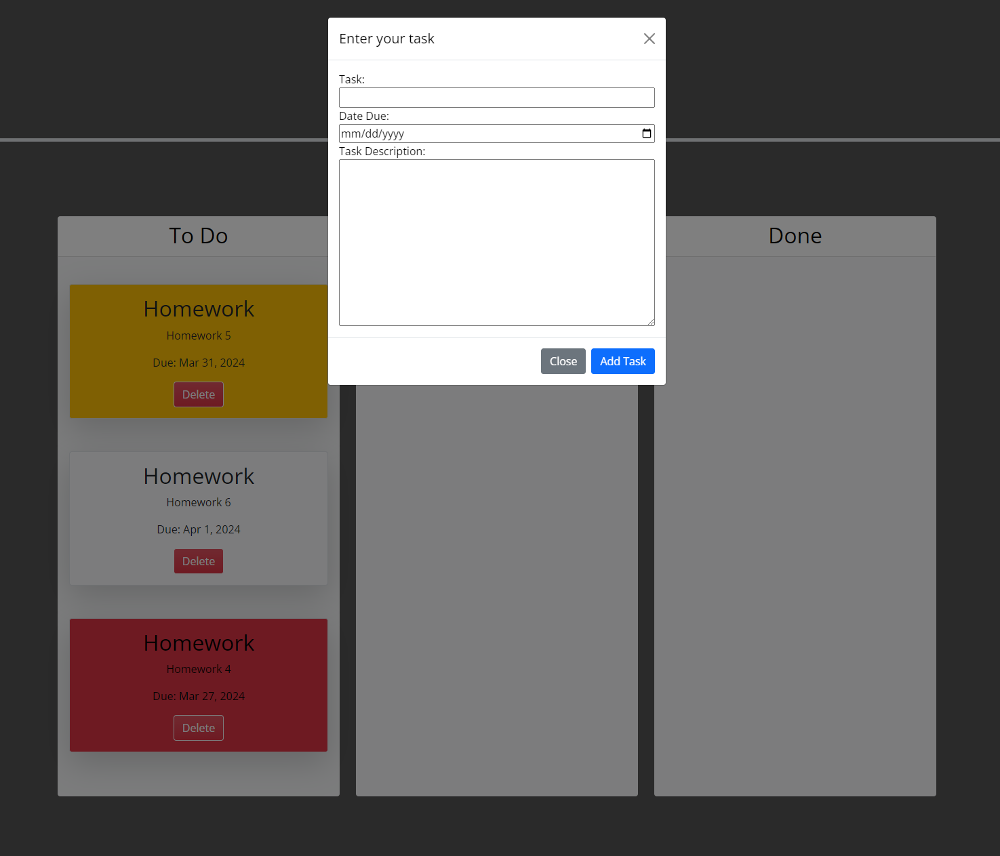
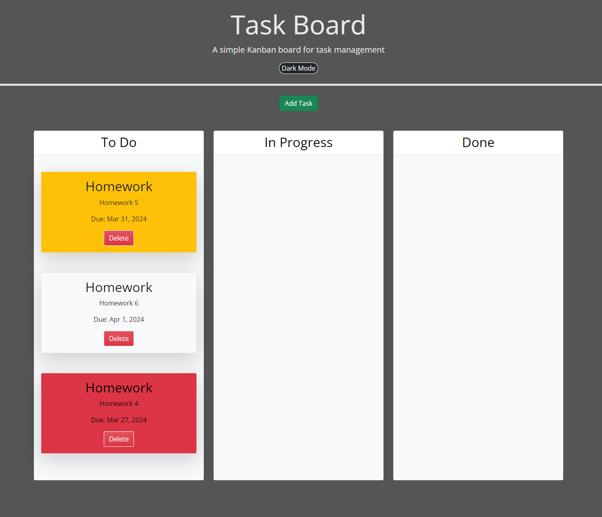

# Task-Board

## Description

This webpage is a task board I made for the Rutgers coding bootcamp. The assignment entailed creating and deploying a task board using third party API's to meet a list of criteria. I was taksed with creating a task list that uses a Bootstrap modal form to collect input from a user and store it to local storage. Once the data is submitted the modal will be hidden and the task that the user enters will be displayed in tthe "To Do" section. They can make multiple entries that will display one after another and up to about 5 megabytes worth before there is no storage left. Tasks will be draggable and droppable thanks to Jquery. This project really tested my knowledge of Javascript logic and Jquery functions/methods. One of the hardest concepts was how to implament the draggable and droppable functions and im still not 100% sure how it works, but I'll get there.  

## Visuals

## Deployment

Provided as a link here - https://tirwin19.github.io/Task-Board/

## Usage

To use the webpage, you click the "Add Task" button and a pop up form will appear. you will then input the task, due date, and short description of what you want to log on the task board. Multiple entries cxan be made and will be styled in color based on weather it is upcoming, due soon, or past due. This was acheved with Dayjs API Try it out! To inspect each element, you can open the Chrome DevTools by pressing Command+Option+I (macOS) or Control+Shift+I (Windows). A console panel should open either below or to the side of the webpage in the browser. There you can navigate to the Elements tab to check out the HTML, CSS, or Javascript. Also you can click on the Application tab and click the local storage dropdown. Procede to click on the folder that appears and there you will see your tasks stored in the local storage of your browser on your device.
## Credits

JD Tadlock - My Instructor for the Rutgers University Coding Bootcamp for all the help.

## License

Please refer to the LICENSE in the repo.
